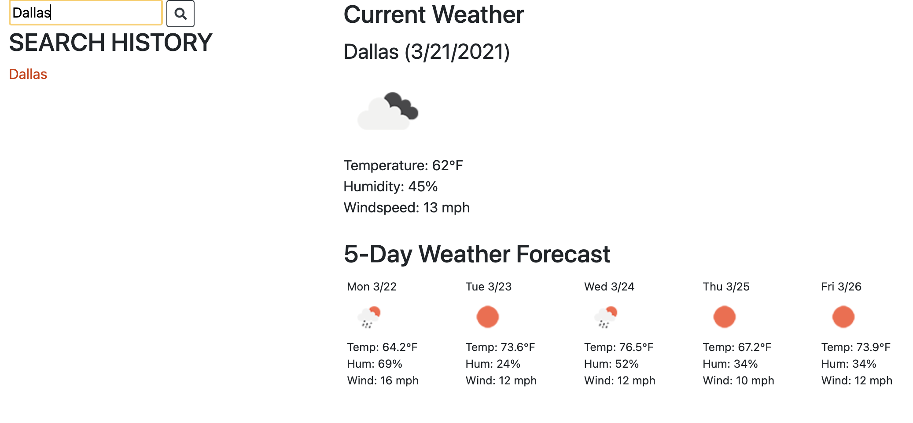

# 06 Server-Side APIs: Weather Dashboard

## Project Discription

- Create a weather dashboard to display current weather and a five day forecast by city utilizing the Openweathermap API. 
- Past searches are stored in local storage and displayed as Search History
- Clicking on a past search will reload the weather for that city

## Screenshot

## Deployed URL

https://davidboerm.github.io/project-1/
